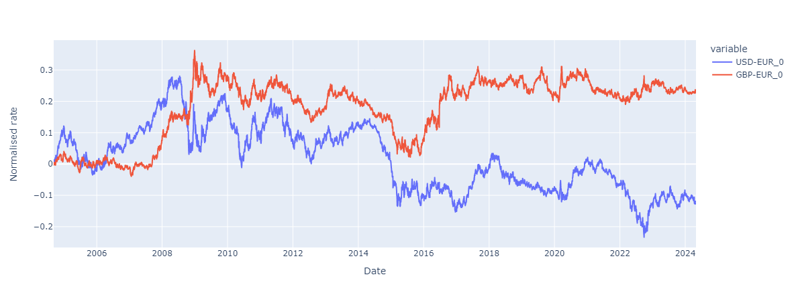

# MarketData

This project includes code and data for yield curve and FX market data analysis.

It is intended to provide a data set for *real-world measure* calibration of cross-asset hybrid models in the [DiffFusion.jl](https://github.com/frame-consulting/DiffFusion.jl) exosure simulation framework.

We use publicly available data from
  - [ECB Data Portal](https://data.ecb.europa.eu/),
  - [US Department of the Treasury](https://home.treasury.gov/interest-rates-data-csv-archive), and
  - [UK Bank of England](https://www.bankofengland.co.uk/statistics/yield-curves).

## Input Data

Input data sources and data consolidation is implemented in [ParseInputData](src/ParseInputData.ipynb) notebook.

Consolidated data are stored in [data_set_full.csv.xz](data/consolidated/data_set_full.csv.xz).

## Data Analysis

We analyse time series data and estimate historically observed volatility and correlation.

Analysis is implemented in [VolatilityAndCorrelations](src/VolatilityAndCorrelations.ipynb).

## Available Data

The project contains data for FX rates and interest rates for EUR, USD and GBP.

|  |
|:--:|
| *Normalised time series of FX rate market data.* |

|  |
|:--:|
| *Normalised time series of interest rates market data.* |
